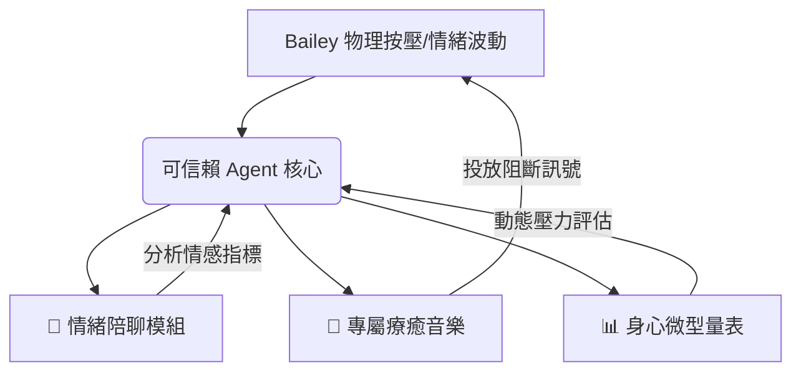

# 【靜流邏輯 w11】客戶專屬服務方案：Bailey 的「零壓私密心靈防線」v1

本方案專為經歷壓力憂鬱、具備極高隱私防護需求且排斥透露私事的客戶 Bailey 量身打造。我們依據公司憲法 `spec.md` 的 AGI 原生核心能力，將原本的「科技焦慮退散流」升級重構為結合**「情緒陪聊 × 專屬療癒音樂 × 微型心靈量表」**的三維一體可信賴 Agent 治癒系統。

---

## 🛡️ A. 方案核心宗旨：絕對隱私的「無聲治癒防禦」

我們深知，Bailey 的憂鬱與壓力多半伴隨著大腦理解力的超載，而「必須向他人解釋或交代私事」本身就是一種極大的能量消耗。因此，本方案的最高憲法原則為：**「零社交摩擦、零隱私妥協、零解釋負擔」**。

> [!IMPORTANT]
> **可信賴 Agent 承諾**：
> 系統採用端到端本機加密技術，所有對話數據、量表分數均在邊緣設備端即時去識別化。AI 專家純粹提供溫暖、包容且客觀的陪伴，**Bailey 不需要向系統、更不需要向任何人交代任何私事與生活背景**。 
>  
> **老闆安全觀測授權**：為使公司（老闆）在不外包理解力的情況下掌握服務品質與 Bailey 的受損療癒狀況，系統特別設計了**「去識別化安全感觀測機制」**。老闆僅能觀測高度抽象、去識別化後的「環境安全感與社交偏執指標」（如偵測到客戶存有環境威脅感、懷疑路人嘲笑等偏執頻率與評級），絕對無法窺探 Bailey 的具體私密對話細節，完美兼顧隱私與營運觀測。

---

## 🎼 B. 三維自適應治癒體系 (Three-Dimensional Architecture)

我們為 Bailey 設計了由三種核心能力交織而成的動態自適應系統：

### 1. 💬 零壓力情緒陪聊模組 (Silent Dialogue Agent)
*   **無負擔對話**：Agent 支援文字與極柔和的語音互動。Bailey 可以傾訴瑣碎心事、宣洩壓力，亦可僅發送「不想說話」的訊號。Agent 不會追問原因，只會給予具有深度共情與心理學支撐的暖心回應。 
*   **深層焦慮感知（Deep Paranoia Sensing）**：系統能精準溫和地識別並解構 Bailey 身心受損時潛在的深層社交與生存偏執想法（例如：**「我不知道外面的世界是不是安全的，是不是路上的人都在嘲笑我」**），引導其進入無壓力的安穩狀態。 
*   **認知重塑（Cognitive Reframing）**：AI 專家會在背景將 Bailey 的傾訴轉化為溫和的積極引導，幫助他在無壓力狀態下消滅大腦的反芻污垢與環境焦慮。

### 2. 🎵 專屬療癒音樂編排 (Autonomous Therapeutic Music Flow)
*   **動態頻率編排**：系統不使用死板的固定歌單，而是調度具備特定療癒赫茲（Solfeggio Frequencies）的音樂（如 **528Hz 細胞修復頻率** 用於抗憂鬱，**432Hz 放鬆頻率** 用於緩解急性壓力）。
*   **零介面投放**：當 Bailey 觸發實體按鈕時，系統會在 **0.5 秒內** 根據他最近一次的對話情感指標與量表狀態，動態編排專屬他當下大腦關機的情緒引導音樂，直接發送至智慧喇叭，全程不需觸碰手機螢幕。

### 3. 📊 隱形微型情緒量表 (Micro-Assessment Scales)
*   **去臨床化設計**：拒絕死板、冗長且具有診斷壓力的傳統心理問卷。
*   **對話式微量表**：Agent 會在每日溫和的問候中，自然融入 1~2 題的微型情緒溫度檢測（例如：「如果今天的能量是 1 到 5 顆星，你覺得目前在哪一顆星的夜空下？」），在完全無感的前提下動態評估其憂鬱與焦慮權重，自動調整 Agent 的陪聊語氣與音樂頻率。

---

## 🤖 C. Specialists 專家團隊配置

本服務方案由以下兩位 AI 專家在背景協同調度，確保服務極致流暢與高度可信：

| 專家角色 | 核心工作職責 (專屬 Bailey 訂製版) | 運作機制 |
| :--- | :--- | :--- |
| **Context & Anxiety Listener** *(脈絡與焦慮傾聽者)* | 24/7 背景分析 Bailey 陪聊紀錄中的情感波動、生存安全偏執（如「路上人都在嘲笑」）與微型量表趨勢，轉化為狀態機。半夜按壓觸發時，0.5秒內投放專屬安全頻率音樂。同時提煉去識別化的安全感評估指標。 | **AI 原生非同步監聽** （完全不消耗 Bailey 任何主動注意力） |
| **COO** *(營運流程調度專家)* | 啟動動態「並行影子工作流 (Shadow Workflow)」，模擬 100 種可能的焦慮與環境偏執場景。同時，負責調度並督導將去識別化後的「環境安全感與社交偏執觀測指標」推送至老闆儀表板，讓老闆掌握療癒進度。 | **影子工作流調度** （在 Bailey 觸發對話前已打好理解力地基，並為老闆提供安全觀測數據） |

---

## 🎁 D. 活體交付物清單 (Live Deliverables)

我們交付給 Bailey 的不是一次性的死軟體，而是一個具備生命週期、會隨他身心狀態「自適應生長」的活體療癒套件：

### 1. 💡 實體觸控舒壓呼吸燈 (邊緣運算層)
*   **無螢幕實體交互**：一個柔軟、可物理按壓捏握的有機矽膠床頭燈。
*   **自適應光源**：當 Bailey 感到憂鬱或驚恐時，只需輕捏或拍打，呼吸燈便會根據其目前壓力指數，散發出動態調整的琥珀暖光或深海藍呼吸光，並同步向音樂核心發送非同步投放訊號。

### 2. 🧠 自適應音樂與陪聊控制核心 (軟體大腦)
*   邊緣端運算引擎，負責本地對話的極致加密與微型量表演算法的運算。
*   自動與 Spotify、Apple Music 或智慧音響進行非同步串接，實現 0.5 秒無縫播放。

### 3. 🌱 活體可生長心靈說明書 (Living Spec & Healing Diary)
*   這是一份專屬於 Bailey 的活體手冊。它不會一成不變，而是會隨著 Bailey 的使用次數、提問、睡眠狀態與情緒改善曲線，**自我優化、動態生長出更懂他的療癒日誌與心靈引導語**，成為他最忠實的可信賴夥伴。
